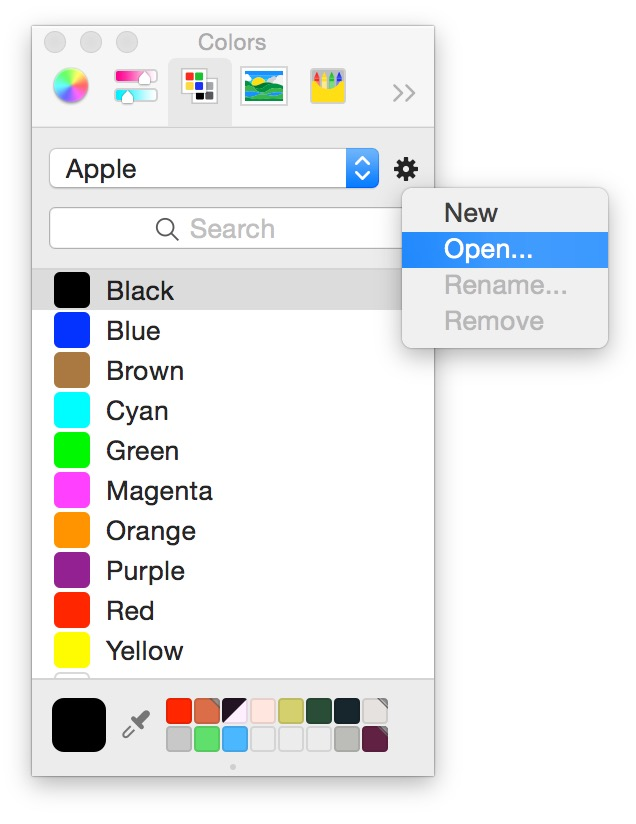

## ColorTool

This tool takes a JSON input file and generates some output files to help developers on their projects. At the moment it is Cocoa-centric, but we would like to extend it to create CSS output, output suitable for Android, etc.

### Using

Compiled with Xcode, a command line application is created named `ColorTool`. It can be invoked by the command:

`ColorTool myColors.json`

Based on the instructions in the input file, it will create output files of the desired format.

### Input File Format

```
{
    "name":"SampleCorp Colors",
    "output":{
        "dir":"/Users/barbecuesteve/Code/SOG/ColorTool",
        "writers":{
            "objc":{
                "class":"SCColor",
                "platform":"ios"
            },
            "clr":{
                "file":"SampleColors.clr"
            }
        }
    },
    "colors":[
              { "name":"Super white",  "hex":"#ffffff" },
              { "name":"Super black",  "hex":"#000000" },
              { "name":"random color", "red":0.88, "green":0.55, "blue":0.283 }
    ]
}

```

- `name` will be used in the CLR file
- `output` is the section describing the output. 
   - `objc` creates Objective-C output files. 
      - The `class` variable sets the class name (name will be capitalized and `Color` appended if these are not included)
      - The optional `"platform":"ios"` variable chooses `UIColor` and `UIKit` over `NSColor` and `AppKit`.
    - `clr` creates an Apple Color Palette file. Color files are imported like so:
    - 
- `colors` describes the array of colors.
	- Colors may specified as hex or rgb, as described.	

